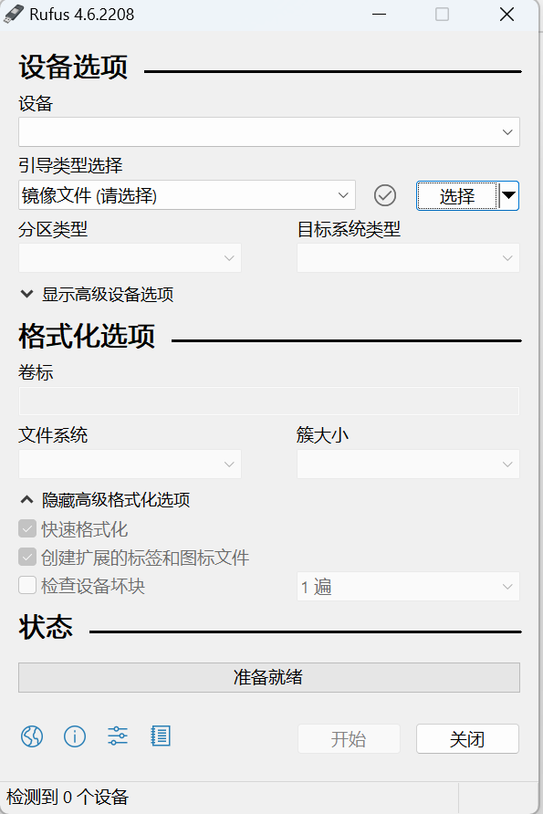
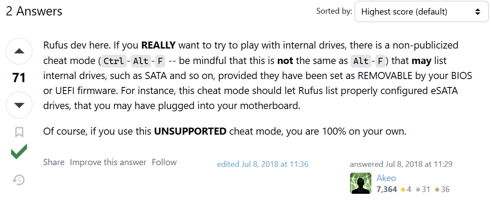
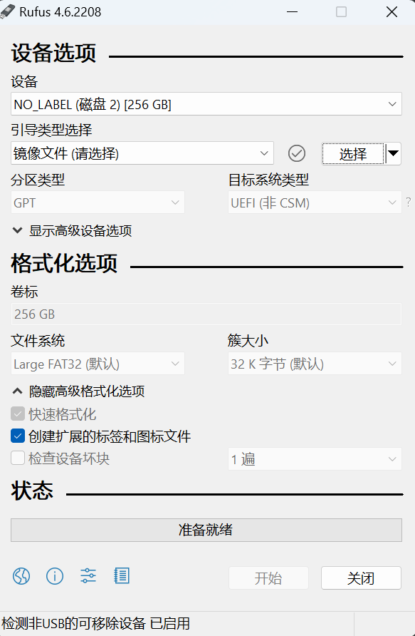

之前在海鲜市场上定做了一个无敌固态U盘，一直以来都是当WinToGo紧急救援盘用，这两天感觉之前装的系统太老了，WinToGo好像还不支持大版本更新，于是准备往里重新刷个Win10 LTSC。

但问题出现了，以前用的国产WinToGo安装器搜了半天只找到各种下崽站的地址，根本找不到原始发布地址，我敢用吗，我不敢。

突然我找到了一篇文章说Rufus也能装WinToGo，这我熟啊，以前都是用Rufus做系统安装U盘的。这还不是手到拈来

但是当我打开Rufus的时候，它不显示我的固态U盘

这一下子硬控住我了，但是转念一想，固态U盘走的是Sata协议，也就是说它在系统里识别的是一个可插拔的Sata硬盘，Rufus会不会只列出USB便携设备

于是去搜了一下，果然搜到了开发者的留言，开发者说为了防止有憨批瞎几把操作，就把除USB便携存储器之外的硬件都隐藏了

不过有一个快捷键CTRL+ALT+F，能够解锁Rufus的黑暗力量，列出内置硬盘

按下快捷键，Rufus卡顿一两秒以后，显示出来了我的私人定制固态U盘

导入镜像，选择WinToGo模式，启动安装，我的新救援盘就做好了

