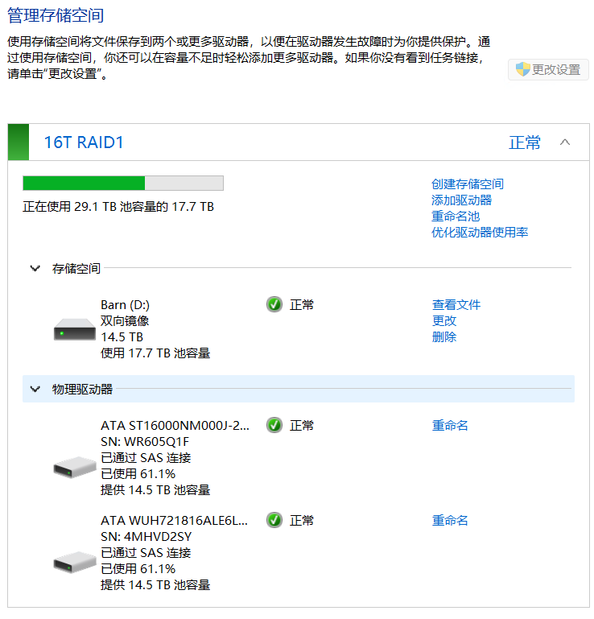
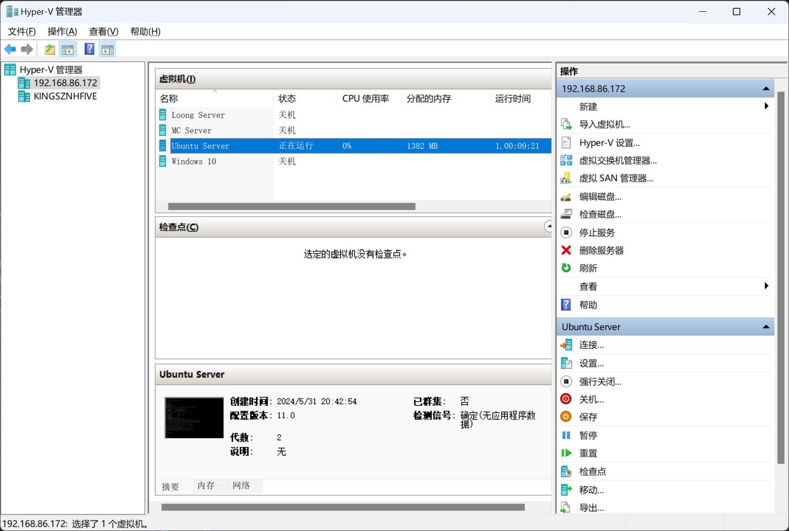
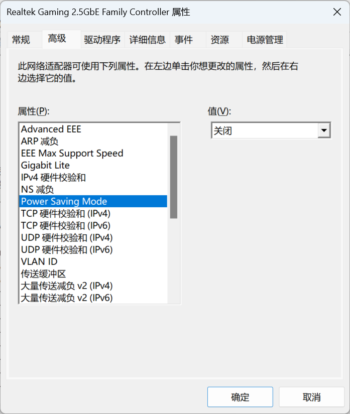
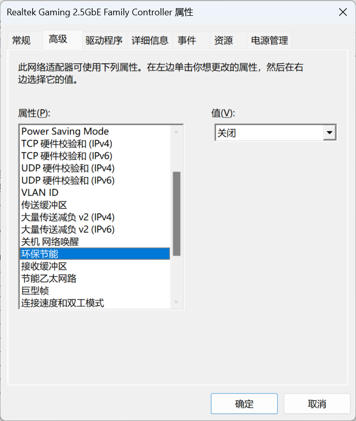
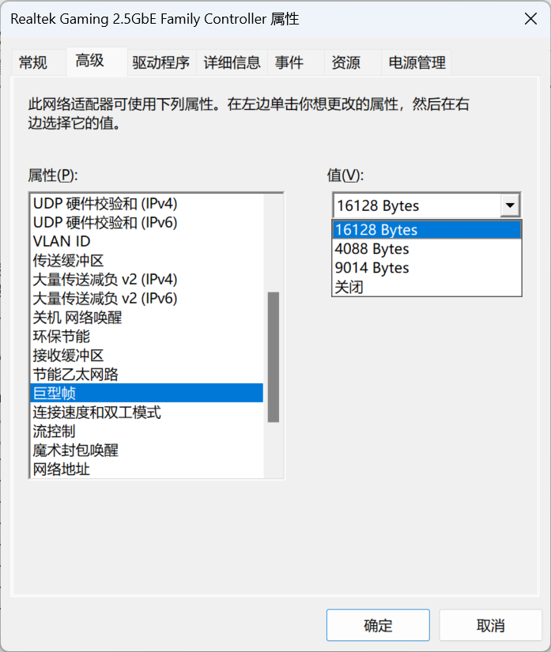
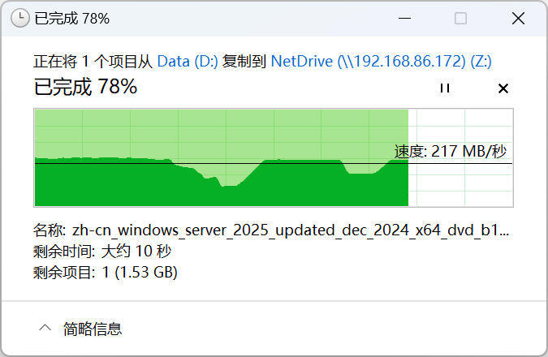

我之前自己装了一台无敌Windows 11 All in boom.

用Storage space组软RAID1，再开SMB共享硬盘空间给我的主力~~游戏机~~开发机

系统服务里挂着DDNS jellyfin syncthing caddy等一系列NAS常用的服务

HyperV左手MC服务器，右手Ubuntu开发环境，胯下一个Win10测试环境，用的不亦乐乎

但是一直都有一个奇怪的问题困扰着我

以前用群晖的时候，传输大文件的时候会稳定跑满千兆电口

现在换了2.5G局域网，传输大文件的时候速度就像过山车一样上上下下，

传了1个多G数据，突然掉到每秒十几M，过几秒又恢复正常，然后往复循环

肯定不会是硬盘的瓶颈问题，我的企业盘再不济也能有200m稳态写入的

就在昨天我终于找到原因了，是网卡驱动设置导致的掉速

有好几个设置都会影响2.5G网卡的发挥

首先就是省电模式得关了

还有环保节能也关了，全国人民的网卡一起满速传输能有富哥的一趟私人飞机游艇银趴碳排放多吗？

最重要的是巨型帧必须打开，可以大幅度增加高带宽传输的稳定性

确保交换机也支持巨型帧，买之前记得问问客服

Win11服务器和游戏机两边的网卡都设置好以后，速度终于不是过山车了，

基本上可以认为是顶着机械盘的写入速度在跑

因为windows缓存机制的介入，还是不够平滑，不过稳定性比之前强多了

