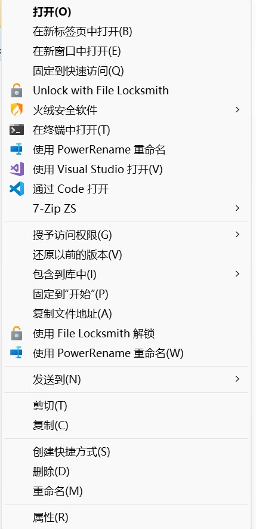
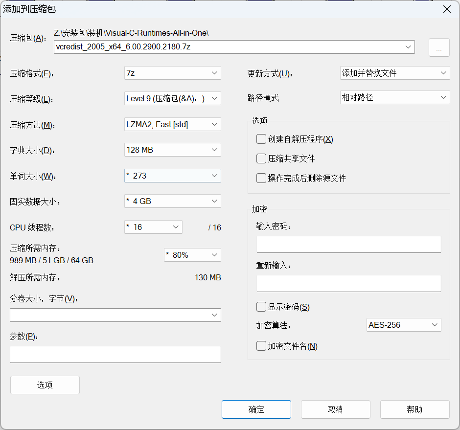
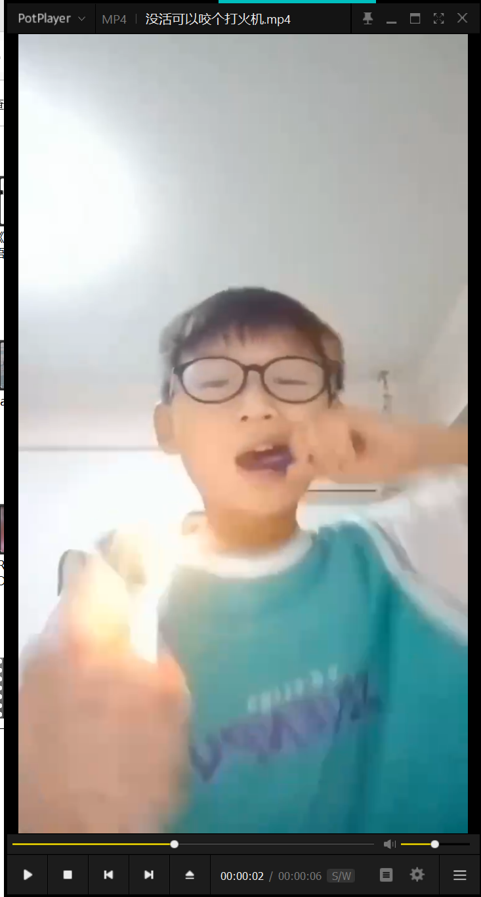
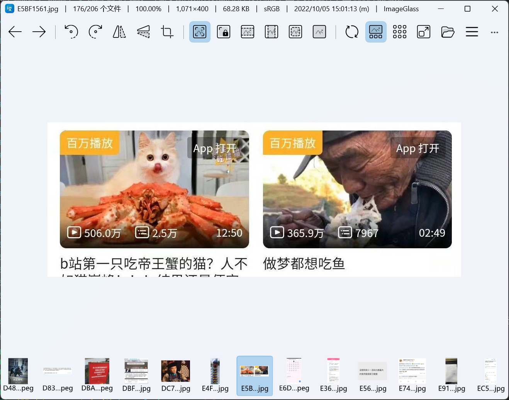
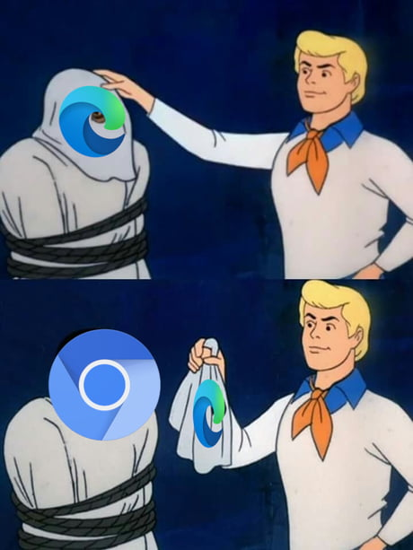
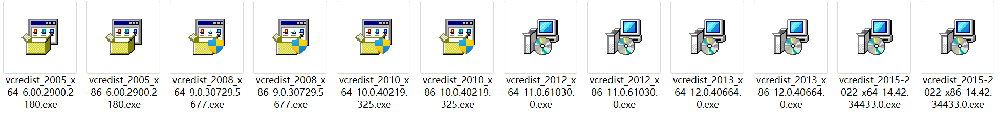

Win11作为Win10的换皮美容大版本，变好看的同时也搞出了一些令人智熄的操作

虽然UI上的Bug很多，但是内核组件引入了很多现代的先进特性，这让我不得不考虑常驻win11

装完系统做一些简单的调整，就能找到熟悉的Win10感觉

再搞点优秀的软件，日常生活的需求全覆盖

# 经典右键菜单

win11的右键菜单换了一套全新的框架，这就导致一些老软件的右键菜单注册跟不上时代了。



无法忍受赛博丈育专用右键菜单？

试试这个

```reg add "HKCU\SOFTWARE\CLASSES\CLSID\{86ca1aa0-34aa-4e8b-a509-50c905bae2a2}\InprocServer32" /f /ve```

不管是Win+R还是powershell还是CMD，怼进去就完了

重启以后就能找回熟悉的右键菜单，不知道什么时候微软会把这个功能添加到设置里


# 开始按钮位置

我是想不通产品设计师是怎么想到把开始按钮放到屏幕中间的

空空如也的左下角让我感觉我不会用电脑了

我大概已经是老登了吧，左下角的开始按钮已经陪了我一辈子，戒不掉了

这个设置还挺好找的，离熟悉的Win10又近了一步


# 必装软件

想要不被网小鬼笑话你是赛博丈育，电脑上一定要装这几个软件

#### 火绒

都什么年代了还在用安全猥士和视奸管家


要么火绒，要么裸奔

Windows自带的defender性能非常强悍，已经是综合性能T0的杀毒软件了，全方位防护滴水不漏

缺点是有时候搞一些注册机和破解也会被后台偷偷删掉

装火绒的作用就是不要让defender乱扫文件

https://www.huorong.cn/

#### 7-Zip-zstd

全能压缩解压软件，免费无广，还拥有目前综合性能最强的FastLZMA2和ZSTD压缩算法



https://github.com/mcmilk/7-Zip-zstd

#### PotPlayer

全能音视频播放器，免费无广，还能自定义分离器渲染器



支持一般人能接触到的所有媒体格式

字幕组不推荐potplayer，原因是想最强的画面表现需要调的配置很多

然而我的近视散光看不出来精调LAV Filters + madVR火力全开，播放10bit的冻鳗画质有变好

https://potplayer.daum.net/

附：Potplayer精调教程，喜欢折腾的可以试一下

https://vcb-s.com/archives/7228

#### ImageGlass

一款高性能图片查看器，免费无广，也可以在微软商店充钱支持作者



使用体验比系统自带的图片查看器高到不知道哪里去了

https://imageglass.org/

#### Chrome

这个就见仁见智了，现在Edge就是个套皮Chrome，我个人和google生态绑定的比较密切，就用Chrome了



#### .NET 8 Runtime

越来越多桌面Navite程序开始使用.NET 8开发，不过这东西倒是不需要提前装，运行.NET 8的软件时如果机器上没有运行时，会自动提示下载

.NET 10会不会预装到win11里啊，我好急

#### Visual-C-Runtimes-All-in-One

这玩意就是一堆粪海狂蛆凝固金汁，2005发酵至今，风味醇厚的C++运行库



运行一些有年头的软件没有它还真的不行，这也是windows历史兼容性的原因

快说，谢谢微软

如果你有Steam，装游戏的时候它大概率会帮你装好运行库全家桶

为了让人成功打开游戏不会红温退款，G胖真是操碎了心

https://www.techpowerup.com/download/visual-c-redistributable-runtime-package-all-in-one/

#### Steam

游戏肥宅必装，伟大，无需多言


# 哔哔两句

每个人都有自己的工作娱乐环境，就不啰嗦更专业向的软件了

知识就是财富，这个世界充斥着各种智商税和时间税

拥有足够的知识，就能节省下来时间和金钱，投入更有意义的事情

我对赛博丈育有一个分级

一级赛博丈育：不会使用包括手机电脑平板在内的电子产品

二级赛博丈育：不会使用搜索引擎和LLM获取需要的知识

三级赛博丈育：不会写代码，无法借助计算机的力量完成简单重复浪费生命的事情

对应到古时候的丈育就是不会说话，不会认字，不会写文章

IT技术正在改变社会的方方面面

社会的组织结构，生产关系，文化和主流思潮都会因IT技术而发生改变

但同时会有越来越多的人被远远甩在后面

日新月异的技术在他们眼中就如同魔法一样

直到再也无法理解这个世界的运行原理

固执地活在自己的偏见和无良的IT公司和营销号精心编造的谎言中

最后在时代的洪流中被吞噬

赛博扫盲刻不容缓，而我又能做些什么呢？