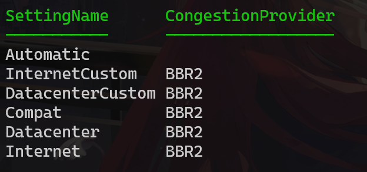

``` ini
# ---- 拥塞控制 ----
# 队列调度器，配合 BBR 使用，降低排队延迟
net.core.default_qdisc = fq
# BBR 拥塞算法，高延迟/高丢包线路下吞吐显著优于默认的 CUBIC
net.ipv4.tcp_congestion_control = bbr

# ---- Socket 缓冲区上限 ----
# 单个 socket 接收/发送缓冲区的系统上限 512MB
net.core.rmem_max = 536870912
net.core.wmem_max = 536870912

# ---- TCP 自动调优缓冲区（格式：最小值 初始默认值 最大值）----
# 初始默认值保持 256KB，让内核按需动态扩大，避免多连接时耗尽内存触发全局限速
net.ipv4.tcp_rmem = 4096 262144 536870912
net.ipv4.tcp_wmem = 4096 262144 536870912

# ---- TCP 行为调优 ----
# 接收窗口占缓冲区的 50%（值为 2 时仅 25%，高延迟链路吞吐损耗明显）
net.ipv4.tcp_adv_win_scale = 1
# 连接空闲后不重置拥塞窗口，长肥管道恢复更快
net.ipv4.tcp_slow_start_after_idle = 0
# 启用显式拥塞通知，网络拥塞时减少丢包而非直接丢弃数据
net.ipv4.tcp_ecn = 1
# 更积极的早期重传，减少等待 RTO 超时的时间
net.ipv4.tcp_early_retrans = 1
# 连接失败前最大重传次数（默认 15），更快判定并释放死连接
net.ipv4.tcp_retries2 = 12
# 乱序容忍度（默认 3），代理链路乱序较多时避免误判为丢包触发不必要重传
net.ipv4.tcp_reordering = 15

# ---- 端口与连接资源 ----
# 出站端口范围（默认仅约 28K 个，并发出站连接多时容易耗尽）
net.ipv4.ip_local_port_range = 1024 65535
# 允许复用 TIME_WAIT 状态的端口，减少端口等待
net.ipv4.tcp_tw_reuse = 1
# FIN_WAIT2 超时（默认 60s），缩短后更快释放端口
net.ipv4.tcp_fin_timeout = 15
# TIME_WAIT 连接数上限（默认 32768），超出后内核强制 RST，调大避免误杀正常连接
net.ipv4.tcp_max_tw_buckets = 1000000

# ---- 监听队列 ----
# 已完成三次握手、等待 accept() 的队列上限
net.core.somaxconn = 32768
# 半连接（SYN_RECV）队列上限，防止连接突刺时丢 SYN
net.ipv4.tcp_max_syn_backlog = 32768

# ---- 网卡收包队列 ----
# 网卡收包后交给内核处理前的队列长度，防止流量突发时丢包
net.core.netdev_max_backlog = 16384

# ---- Keepalive 死连接检测 ----
# 默认需等 7200s 才开始探测，代理的死连接会长期占用文件描述符
# 连接空闲 60s 后开始发送探测包，每 10s 一次，连续 3 次无响应则断开
net.ipv4.tcp_keepalive_time = 60
net.ipv4.tcp_keepalive_intvl = 10
net.ipv4.tcp_keepalive_probes = 3

# ---- 发送缓冲限制 ----
# 发送缓冲中待发数据超过 128KB 才继续写入，降低代理链路排队延迟
net.ipv4.tcp_notsent_lowat = 131072
```

#### 开启 BBR 与队列调度
```
net.core.default_qdisc = fq
net.ipv4.tcp_congestion_control = bbr
```
- `net.core.default_qdisc = fq`：使用 Fair Queueing（fq）作为默认队列调度器，能配合 BBR 降低排队延迟，避免单连接占满队列。
- `net.ipv4.tcp_congestion_control = bbr`：启用 BBR 拥塞控制，在高延迟或丢包较多的跨洋链路上通常比 CUBIC 有更高的吞吐和更低的延迟。

#### 单个 socket 缓冲区上限（允许大窗口以支持高 BDP 链路）
```
net.core.rmem_max = 536870912
net.core.wmem_max = 536870912
```
- 将单个 socket 的接收/发送缓冲区上限调到 512MB，保证在高带宽延迟乘积（BDP）场景下内核有足够空间扩展窗口。

#### TCP 自动调优缓冲区（格式：最小 初始 默认 最大）
```
net.ipv4.tcp_rmem = 4096 262144 536870912
net.ipv4.tcp_wmem = 4096 262144 536870912
```
- 三个值分别是最小、默认、最大。保持默认初始值为 256KB（262144）可以让内核按需增长，既避免一开始就消耗大量内存，又能在需要时扩展到最大值以提高吞吐。

#### TCP 行为与鲁棒性调整
```
net.ipv4.tcp_adv_win_scale = 1
net.ipv4.tcp_slow_start_after_idle = 0
net.ipv4.tcp_ecn = 1
net.ipv4.tcp_early_retrans = 1
net.ipv4.tcp_retries2 = 12
net.ipv4.tcp_reordering = 15
```
- `tcp_adv_win_scale = 1`：接收端广告窗口占缓冲区的比例为 50%，对高延迟链路更友好（配置段中的注释：值为 2 时仅 25%）。
- `tcp_slow_start_after_idle = 0`：连接空闲后不重置拥塞窗口，避免在长连接空闲后重新进入慢启动，能更快恢复吞吐。
- `tcp_ecn = 1`：启用显式拥塞通知（ECN），在支持的网络设备上以标记代替丢包，降低重传和丢包对吞吐的影响。
- `tcp_early_retrans = 1`：启用更积极的早期重传，减少等待 RTO 的时间。
- `tcp_retries2 = 12`：将最大重传次数从默认值（通常 15）调低，能更快回收挂死连接，释放资源。
- `tcp_reordering = 15`：增加对乱序的容忍度（默认 3），避免代理链路或多跳路径引起的乱序被误判为丢包。

#### 端口与连接资源
```
net.ipv4.ip_local_port_range = 1024 65535
net.ipv4.tcp_tw_reuse = 1
net.ipv4.tcp_fin_timeout = 15
net.ipv4.tcp_max_tw_buckets = 1000000
```
- 扩大出站端口范围，避免并发出站连接耗尽短端口。`tcp_tw_reuse=1` 允许重用 TIME_WAIT 端口，`tcp_fin_timeout=15` 缩短 FIN_WAIT2 超时，`tcp_max_tw_buckets` 提高 TIME_WAIT 上限以防被内核强制 RST。

#### 监听与队列
```
net.core.somaxconn = 32768
net.ipv4.tcp_max_syn_backlog = 32768
net.core.netdev_max_backlog = 16384
```
- `somaxconn` 与 `tcp_max_syn_backlog` 提高了 accept/半连接队列容量，能抵抗短时间的连接冲击。
- `netdev_max_backlog` 增大网卡接收队列，减少流量突发时内核丢包的概率。

#### Keepalive（死连接检测）与发送缓冲行为
```
net.ipv4.tcp_keepalive_time = 60
net.ipv4.tcp_keepalive_intvl = 10
net.ipv4.tcp_keepalive_probes = 3
net.ipv4.tcp_notsent_lowat = 131072
```
- Keepalive 配置让空闲连接在 60s 后开始探测，每 10s 探测一次，连续 3 次无响应则断开，避免代理的死连接长期占用文件描述符。
- `tcp_notsent_lowat = 131072`：设置发送缓冲的低水位阈值，只有当待发数据超过 128KB 时才继续写入，能降低代理链路上的排队延迟（减少内核队列堆积）。

---
追加配置后运行 `sudo sysctl -p`（或 `sudo sysctl --system`）立即应用

若希望在启动时自动生效，写入 `/etc/sysctl.conf` 或 `/etc/sysctl.d/*.conf` 中。

# 客户端优化

Windows 11 22H2没有默认启用BBR策略

开启管理员Powershell，执行以下指令，便可以开启Windows客户端侧的BBR策略

```
netsh int tcp set supplemental Template=Internet CongestionProvider=bbr2
netsh int tcp set supplemental Template=Datacenter CongestionProvider=bbr2
netsh int tcp set supplemental Template=Compat CongestionProvider=bbr2
netsh int tcp set supplemental Template=DatacenterCustom CongestionProvider=bbr2
netsh int tcp set supplemental Template=InternetCustom CongestionProvider=bbr2

Get-NetTCPSetting | Select SettingName, CongestionProvider
```


